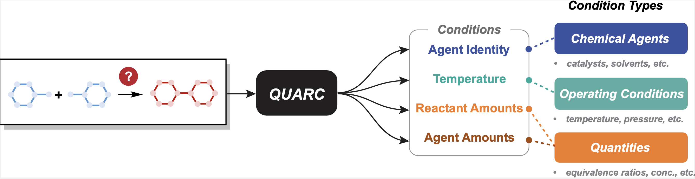

# QUARC (QUAtitative Recommendations of reaction Conditions)

<!--
[](https://www.python.org/downloads/)
[](LICENSE)
[](https://pytorch.org/) -->

QUARC is a data-driven model for recommending agents, temperature, and equivalence ratios for organic synthesis (see [paper](https://chemrxiv.org/engage/chemrxiv/article-details/686809c0c1cb1ecda020efc1)).



> [!IMPORTANT]
> The QUARC models used in the paper rely on the **[NameRxn](https://www.nextmovesoftware.com/namerxn.html) reaction classification codes** as part of the model input. Specifically, the reaction class is encoded as a one-hot vector, requiring access to the full NameRxn code mapping.
>
> - Users with a Pistachio license can access the **2023Q4** reaction-type mapping (2271 NameRxn classes plus Unrecognized) from the `Pistachio Reaction Types.csv` file on the Pistachio webapp. Alternatively, you may email xiaoqis@mit.edu to obtain the file directly.
>
> - Users without NameRxn access can try our [open-source version](https://github.com/Xiaoqi-Sun/quarc-oss), which eliminates this dependency. This version is planned to be integrated into [ASKCOS](https://gitlab.com/mlpds_mit/askcosv2) in the October release.

<!--
- [QUARC (QUAtitative Recommendations of reaction Conditions)](#quarc-quatitative-recommendations-of-reaction-conditions)
  - [Quick Start (Inference Only)](#quick-start-inference-only)
    - [Step 1/3: Environment Setup](#step-13-environment-setup)
    - [Step 2/3: Download pretrained models](#step-23-download-pretrained-models)
    - [Step 3/3: Run Predictions](#step-33-run-predictions)
  - [Usage](#usage)
    - [Inference with custom data](#inference-with-custom-data)
  - [Retraining](#retraining)
    - [Step 1/5: Environment Setup](#step-15-environment-setup)
    - [Step 2/5: Data Preprocessing](#step-25-data-preprocessing)
    - [Step 3/5: Training](#step-35-training)
    - [Step 4/5: Create a new pipeline config](#step-45-create-a-new-pipeline-config)
    - [Step 5/5: Inference with custom pipeline](#step-55-inference-with-custom-pipeline)
  - [References](#references) -->

## Quick Start (Inference Only)

If you just want to predict conditions for your reactions using the provided pretrained models:

### Step 1/3: Environment Setup

```bash
# 1. Create conda environment
conda env create -f environment.yml -n quarc
conda activate quarc
pip install --no-deps -e .

# 2. Configure NameRxn Code Mapping (REQUIRED)
export PISTACHIO_NAMERXN_PATH="/path/to/your/Pistachio Reaction Types.csv"

# 3. Optional: Set data paths (uses defaults if not set)
export DATA_ROOT="~/quarc/data"
```

_The 2023Q4 version of `Pistachio Reaction Types.csv` is required for compatibility with the pretrained models (requires 2272 classes for reaction class encoding). Using a different version may cause the model to fail._

### Step 2/3: Download pretrained models

```bash
sh checkpoints/download_trained_models.sh
```

### Step 3/3: Run Predictions

```bash
# Get predictions using the example input file
python scripts/inference.py \
    --config-path configs/ffn_pipeline.yaml \
    --input data/example_input.json \
    --output predictions.json \
    --top-k 5
```

Results will be in `predictions.json` with recommended agents, temperatures, and amounts. Atom-mapped SMILES are required for the GNN models.

## Usage

### Inference with custom data

**Input Format**

```json
[
  {
    "rxn_smiles": "[CH3:1][O:2][C:3]...",
    "rxn_class": "1.8.7",
    "doc_id": "my_reaction_1"
  }
]
```

**Model Options**

```bash
# FFN models (works with any SMILES)
python scripts/inference.py \
    --config-path configs/ffn_pipeline.yaml \
    --input input.json \
    --output predictions.json \
    --top-k 5

# GNN models (requires atom-mapped SMILES)
python scripts/inference.py \
    --config-path configs/gnn_pipeline.yaml \
    --input input.json \
    --output predictions.json \
    --top-k 5

# Also supports pickle input (e.g., preprocessed test sets)
python scripts/inference.py \
    --config-path configs/ffn_pipeline.yaml \
    --input data/processed/overlap/overlap_test.pickle \
    --output predictions.json \
    --top-k 5
```

<!-- #### Output Format

Results include ranked predictions with confidence scores, agent SMILES, temperature ranges, and equivalence ratios. See [example output](data/example_output.json). -->

<!-- ### Benchmarking

To evaluate QUARC on your own test sets:

```bash
# Run evaluation with ground truth conditions
python scripts/evaluate.py \
    --input data/test_reactions.json \
    --config configs/eval_config.yaml
``` -->

---

## Retraining

> **Note**: Requires Pistachio's density data and NameRxn access

### Step 1/5: Environment Setup

Create conda environment and install dependencies:

```bash
conda env create -f environment.yml -n quarc
conda activate quarc
pip install --no-deps -e .
```

Configure paths using one of the following options:

- **Option 1**: Environment Variables

  Variables can be set directly in terminal or in a `.env` file.

  ```bash
  # data paths
  export DATA_ROOT="~/quarc/data"
  export PROCESSED_DATA_ROOT="~/quarc/data/processed"
  export CHECKPOINTS_ROOT="~/quarc/checkpoints"
  export LOGS_ROOT="~/quarc/logs"

  # needed for inference
  export PISTACHIO_NAMERXN_PATH="/path/to/Pistachio Reaction Types.csv"

  # needed for preprocessing
  export PISTACHIO_DENSITY_PATH="/path/to/density.tsv"
  export RAW_DIR="/path/to/pistachio/extract"
  ```

- **Option 2**: Edit Configuration Files
  Edit `configs/quarc_config.yaml` to modify default paths.

### Step 2/5: Data Preprocessing

The preprocessing pipeline transforms raw Pistachio data into `ReactionDatum` objects that are used for training. You can configure the preprocessing pipeline in `configs/preprocess_config.yaml`. The `dirs` section contains placeholders paths that will be overridden by the environment variables. Details of the preprocessing pipeline are described [here](src/quarc/preprocessing/documentation.md).

```bash
# Run complete preprocessing pipeline
python scripts/preprocess.py \
    --config configs/preprocess_config.yaml \
    --all

# Or individual steps
python scripts/preprocess.py \
    --config configs/preprocess_config.yaml \
    --chunk-json \
    --collect-dedup \
    ...
```

### Step 3/5: Training

Run training for each stage:

```bash
# Example: stage 1 agent model gnn
python scripts/train.py \
    --stage 1 \
    --model-type gnn \
    --graph-hidden-size 1024 \
    --depth 2 \
    --hidden-size 2048 \
    --n-blocks 3 \
    --max-epochs 30 \
    --batch-size 512 \
    --max-lr 1e-3 \
    --logger-name stage1_gnn
    ...
```

For stage 1 agent prediction, the tensorboard logger only keeps track of the greedy search accuracy. You may want to perform offline [beam search](src/quarc/models/search.py#L96) evaluation to select the best checkpoint.

### Step 4/5: Create Pipeline Config

To chain the individually trained models together, you can create a new pipeline config file using the `configs/ffn_pipeline.yaml` as a template.

#### Optional: Optimize Stage Weights

By default, each stage in the pipeline is assigned an equal weight of 0.25. To improve the overall performance of chained models, you can tune these weights using hyperparameter optimization with Optuna:

```bash
python scripts/optimize_weights.py \
  --config-path configs/new_pipeline.yaml \
  --n-trials 30 \
  --sample-size 1000 \
  --use-top-k 5 # use top-5 accuracy as the objective
```

> [!TIP]
> The optimization script uses the `EnumeratePredictor` to generate predictions and rank them on the fly. For faster optimization using a larger sample size, you can consider switching to the `PrecomputedHierarchicalPredictor`, which caches model predictions to avoid redundant computations.

### Step 5/5: Inference

The new pipeline config file can be used for inference:

```bash
python scripts/inference.py \
    --config-path configs/new_pipeline.yaml \
    --input data/processed/overlap/overlap_test.pickle \
    --output predictions.json \
    --top-k 5
```

## References

If you find our code or model useful, we kindly ask that you consider citing our work in your papers.

```bibtex
@article{Sun2025quarc,
  title={Data-Driven Recommendation of Agents, Temperature, and Equivalence Ratios for Organic Synthesis},
  author={Sun, Xiaoqi and Liu, Jiannan and Mahjour, Babak and Jensen, Klavs F and Coley, Connor W},
  journal={ChemRxiv},
  doi={10.26434/chemrxiv-2025-4wzkh},
  year={2025}
}
```
