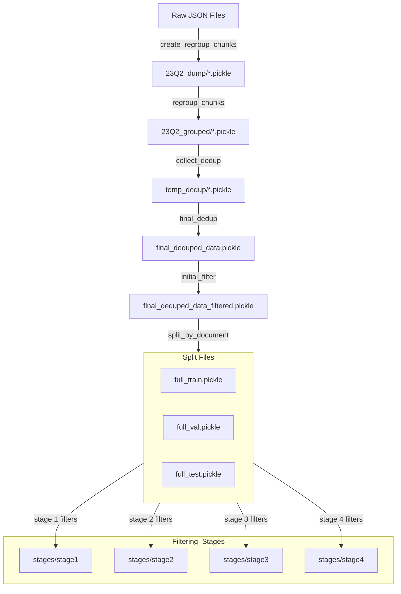

# Detailed documentation for preprocessing pipeline

Data preprocessing pipeline for QUARC.

## Overview

```bash
python preprocess.py --config preprocess_config.json [--chunk_json data/chunks] [--collect_dedup] [--init_filter] [--con_filter] [--all] [--max-cpu N]
```

The preprocessing pipeline consists of the following steps:

```python
   Step 0: Raw JSON Data → Chunks
   ├── Create initial chunks from raw JSON
   └── Group chunks for efficient processing

   Step 1: Data Collection & Deduplication
   ├── Process and validate reactions
   ├── Parallel collection if multiple CPUs
   └── Final deduplication across all data

   Step 2: Agent Classification
   └── Generate agent classes/vocabulary

   Step 3: Initial Filtering
   └── Basic reaction validation/filtering

   Step 4: Condition Filtering
   └── Advanced condition-based filtering
```

## Step 1: Create data chunks from raw JSON files

The raw data comes from Pistachio database extracts (pistachio.zip) with the following structure:

```python
pistachio/
├── epo/
│   └── {year}/
│       └── *.json (one reaction per line)
├── wo/
│   └── {year}/
│       └── *.json
└── ... (other sources like applications, grants)
```

The chunking process happens in two stages:

1. **Initial Chunking**: Convert individual reaction records from raw JSON files into manageable chunks. Each chunk is saved as a pickle file named `{source}_{year}.pickle`.
   - Input: pistachio/extract/
   - Output: 23Q2_dump/

2. **Chunk Grouping**: Combine initial chunks into larger groups for more efficient processing.
   - Input: 23Q2_dump/
   - Output: 23Q2_grouped/

## Step 2: Collect & deduplicate pistachio data

First collect key information from ~15M reactions (with duplicates). Then deduplicate at _**condition-level**_. If two reactions have the same reactants and agents, but with different temperature or different amount, they will considered as different.

### Data collection

A pistachio reaction record has the following structure (TODO: Add example).

From each raw Pistachio reaction record, the `collect_reaction()` function extracts basic information and reaction components:

**Basic Information:**

- `Document id`
- `Reaction class`
- `Date`
- `Reaction SMILES`
- `Temperature` (extracted via `get_temperature()`)

**Reaction Components:**

- `Reactants` (SMILES & amount)
- `Agents` (SMILES & amount)
- `Products` (SMILES & amount)

The component information comes from two sources:

1. **Reaction SMILES**: Contains atom-mapped molecules for reactants, agents, and products. Used to generate reaction graph (Condensed Graph of Reaction).
2. **Pistacho Component Dictionary**: reaction["component"],contains role, SMILES, and quantity information (mixtures or solutions allowed) for each molecule

#### Processing Steps

1. **Quantity Processing**
   - Convert all quantities to moles using `preprocess_quantities.py`
   - Handle mixtures and solutions by splitting into constituents
   - Store converted quantities as intermediate amounts for matching.

2. **Reaction Quality Control**
   - Verify each reaction must have reactants and products
   - Ensure reaction performs a transformation (products not in reactants)
   - Check for no overlap between reaction and agent sets

3. **Component Matching**
   - **Forward Matching**: Check if each item in intermediate amounts is part of reaction SMILES
     - Compare each intermed_amount item against reactant, agent, and product sets, which are parsed from reaction_SMILES (stereo removed)
     - Return matched_reactants, match_agents, and match_products, and unmatched components from intermed_amounts.
     - Allow forward mismatches (e.g., quenching solvents may appear in components). Treat agents defined by reaction SMILES with priority.

   - **Reverse Matching**: Verify all parsed sets from reaction SMILES are covered by intermed_amounts
     - This could happen when SMILES parsing is incorrect, the reaction is not valid. So if a `ReverseMismachError` is raised, this reaction will be rejected.

   - **Merging**: The matched reactants, agents, and products with smiles and converted amount will be saved to appropriate `reactants`, `agents`, and `products`.

### Deduplication

Deduplication occurs in two phases:

1. **Local Deduplication**: Within each chunk during data collection
   - Uses pandas `drop_duplicates()`
   - Considers reactions identical only if they have matching SMILES and conditions

2. **Global Deduplication**: Across all chunks
   - Merges locally deduplicated chunks
   - Performs final deduplication before filtering

## Step 3: Generate Agent Vocabulary

First count agent distribtuion **_only from agents with amounts_** for higher quality of labels. If not, will encounter a lot of encoding issues inlcuding ".O"

- Apply standardization rules (from Jiannan, mainly fixes for ions)
- Keep agents with min occurence of 50 (lower occurrance threshold compared to aount agent distribution without amounts)
- For metal {Pd, Rh, Pt, Ni, Ru, Ir, Fe, Ag, } containing agents, lower the threshold to 50, and add those rare agents to the "other\_{Pd/Rh/...} category (`preprocessingv2/`)
- Append common solvent that might have been missed

*Implementation Notes:*

- Counting frequency using agents with amounts only could underestimate agents common globally but don't have a lot of quantity information
- It's also problematic if quantity calculation failed
- Some remedies added for v3 are (1) add missing densities and (2) append remaining common solvents (have curated a longer list of common solvents according `densities_clean_new.tsv`). For detailed analysis and rationale, check `notebooks/01_agent_generation_analysis`

## Step 4: Initial Reaction Quality Control

This step applies various filters to ensure data quality. All thresholds can be configured in `configs.yaml`.

### Required Filters:

1. **Component Length**
   - Products: Exactly 1 product
   - Reactants: Between 1-5 reactants
   - Agents: Between 0-5 agents

2. **Molecule Size**
   - Maximum 50 atoms for reactants
   - Maximum 50 atoms for products
   - RDKit parsability check for all molecules

3. **Reaction Quality**
   - Exclude reactions with rare/non-standard agents
   - Require either temperature or agent information
   - Verify RDKit parsability for:
     - Complete reaction SMILES (for GNN processing)
     - Individual molecule SMILES (for fingerprint generation)

### Optional Strict Filters:

1. **Solvent Validation** (removes ~20% of data)
   - Check solvent presence in reactants/agents
   - Note: Optional due to inconsistent solvent handling in source data
     (e.g., work-up solvents, solvent mixtures)

2. **Reaction Classification** (removes ~20% of data)
   - Remove unrecognized reactions (class=0.0)

## Step 4: Train/val/test (75:5:20) by document

Split the filtered deduplicated data by documents. For more balanced splits, use group documents by size ranges. Use a 75:5:20 train/val/test split.
filtered_dedup_data -> full_train, full_val, full_test.pickle

## Step 5: Stage-Specific Data Filtering

The full training data is filtered separately for each stage with specific requirements:

### stage_1_data_train

- [x] agent existence: At least 1 agent present
- [ ] agent amount existence: All agents must have quantity information (temporarily removed because agent quality handled by updated agent class already)

### stage_2_data_train

- [x] temperature existence: Temperature must be specified
- [x] temperature ratio range: Temperature must be within -100°C to 200°C

### stage_3_data_train

<!-- - [ ] multiple reactants: At least 2 reactants. Removed because unimolecular reaction should be considered as well -->
- [x] unique reactants: All reactants must be unique
- [x] reactant amount existence: All reactants must have quantity information (except single-reactant cases)
- [x] reactant ratio range: All molar ratios must be within 0 to 7

### stage_4_data_train

- [x] agent existence: At least 1 agent present
- [x] agent amount existence: All agents must have quantity information
- [x] unique agents: All agents must be unique
- [x] agent ratio range: Agent molar ratios (relative to limiting reactant) must be within 0.001 to 1000 (upper bound for solvents only)
- [x] nonsolvent high ratio: Upper bound of 10 for non-solvent agents

Note: These same filters are applied to global_val and global_test sets.

## Preprocessing Roadmap


